# Trivue Platform - Vizuelni Dijagrami Procesa i Integracija

**Datum:** 2025-11-07
**Verzija:** v2.13 (Simplified)
**Status:** Production-Ready

> **NAPOMENA:** Dijagrami su pojednostavljeni za bolju čitljivost - fokus na ključnim komponentama i vezama.
> Za detaljne flow-ove pogledati sequence dijagrame (#2, #3, #4, #6, #7).

---

## 1. Architecture Overview - 11 Modula sa Event Flows

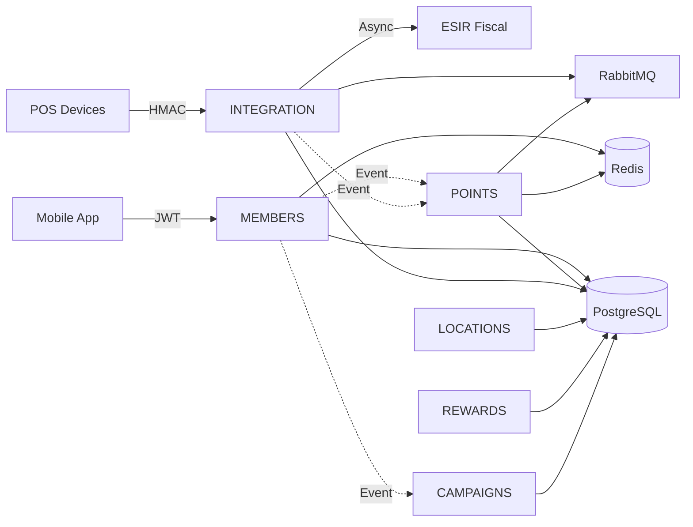

---

## 2. Triple-Layer Event-Driven Architecture

```mermaid
sequenceDiagram
    participant Location as Locations Module
    participant Outbox as Outbox Interceptor
    participant L1 as Layer 1: MediatR<br/>(INSTANT)
    participant L2 as Layer 2: RabbitMQ<br/>(EVENTUAL)
    participant L3 as Layer 3: Redis Cache<br/>(PERFORMANCE)
    participant Integration as Integration Module
    participant DB as PostgreSQL

    Location->>Location: location.Update("New Name")
    Location->>Location: RaiseDomainEvent(LocationUpdated)
    Location->>DB: SaveChanges() - ATOMIC
    DB-->>Outbox: Commit + Outbox INSERT

    Note over Outbox: ICrossModuleEvent Filtering
    Outbox->>Outbox: Is ICrossModuleEvent?
    Outbox->>Outbox: YES → SKIP Layer 1

    Note over L2: Hangfire Job (every 30s)
    L2->>Outbox: ProcessOutboxMessages()
    Outbox-->>L2: LocationUpdatedEvent
    L2->>L2: Publish to RabbitMQ
    L2->>Integration: Consume from Queue

    Integration->>Integration: Inbox Pattern - Check EventId
    Integration->>Integration: NOT processed → Continue
    Integration->>DB: Denormalize LocationName in POS Devices
    Integration->>L3: INVALIDATE cache keys
    L3-->>L3: Remove "integration:pos-devices:*"

    Note over Integration: Handler executed ONCE (no duplication)
```

---

## 3. POS Integration Flow - Transaction Recording

```mermaid
sequenceDiagram
    participant POS as POS Device
    participant HMAC as HMAC Middleware
    participant API as Integration API
    participant Trans as Transaction Aggregate
    participant Points as Points Module
    participant ESIR as ESIR Fiscalization
    participant RabbitMQ as RabbitMQ
    participant DB as PostgreSQL

    POS->>HMAC: POST /api/pos/transactions<br/>Headers: ApiKey, Timestamp, Signature
    HMAC->>HMAC: Validate Timestamp (±5 min)
    HMAC->>HMAC: Lookup PosDevice by ApiKey
    HMAC->>HMAC: Compute HMAC-SHA256(secret, payload)
    HMAC->>HMAC: Compare Signatures
    alt Signature Valid
        HMAC->>API: Continue (set PosDeviceId in context)
        API->>Trans: Transaction.Create(items, totalAmount)
        Trans->>Trans: Validate business rules
        Trans->>Trans: RaiseDomainEvent(TransactionCreated)
        API->>DB: SaveChanges() - ATOMIC
        DB-->>API: Transaction committed

        Note over API: Layer 1 - MediatR (INSTANT)
        API->>Points: Publish TransactionCreatedEvent
        Points->>Points: Calculate points (amount + bonus)
        Points->>DB: Create PointsBatch

        Note over API: Layer 2 - Async Fiscalization
        API->>ESIR: FiscalizeAsync(transaction)
        ESIR-->>API: FiscalReceiptNumber + QR Code
        API->>DB: Update Transaction.Fiscalize()

        API-->>POS: 201 Created + TransactionDto + Fiscal Receipt
    else Signature Invalid
        HMAC->>HMAC: Increment FailedAttempts
        HMAC->>HMAC: Auto-block after 5 failures
        HMAC-->>POS: 401 Unauthorized
    end
```

---

## 4. Member Registration Flow - Cross-Module Events

```mermaid
sequenceDiagram
    participant Mobile as Mobile App
    participant Members as Members Module
    participant Outbox as Outbox Pattern
    participant MQ as RabbitMQ
    participant Points as Points Module
    participant Campaigns as Campaigns Module
    participant Referrals as Referrals Module
    participant DB as PostgreSQL

    Mobile->>Members: POST /api/members/register<br/>{email, password, referralCode}
    Members->>Members: Member.Register()
    Members->>Members: Validate email uniqueness
    Members->>Members: BCrypt hash password
    Members->>Members: RaiseDomainEvent(MemberRegistered)
    Members->>DB: SaveChanges() + Outbox INSERT

    Note over Outbox: Layer 1 SKIPPED (ICrossModuleEvent)
    Outbox->>MQ: Hangfire Job → RabbitMQ Publish

    par Points Module
        MQ->>Points: MemberRegisteredEvent
        Points->>Points: CreatePointsAccount(memberId)
        Points->>DB: Insert PointsAccount (balance: 0)
    and Campaigns Module
        MQ->>Campaigns: MemberRegisteredEvent
        Campaigns->>Campaigns: Enroll in Welcome Campaign
        Campaigns->>DB: Create MemberAchievement
    and Referrals Module (if referralCode)
        MQ->>Referrals: MemberRegisteredEvent
        Referrals->>Referrals: Award referrer bonus (100 points)
        Referrals->>DB: Create Referral record
        Referrals->>Points: Publish PointsEarnedEvent
    end

    Members-->>Mobile: 201 Created + MemberDto
```

---

## 5. Deployment Architecture - Docker Containers

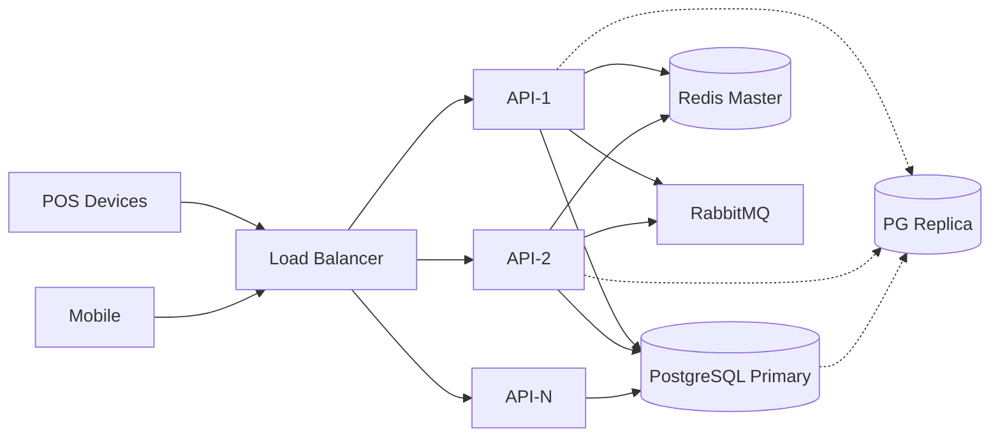

---

## 6. HMAC Authentication Flow

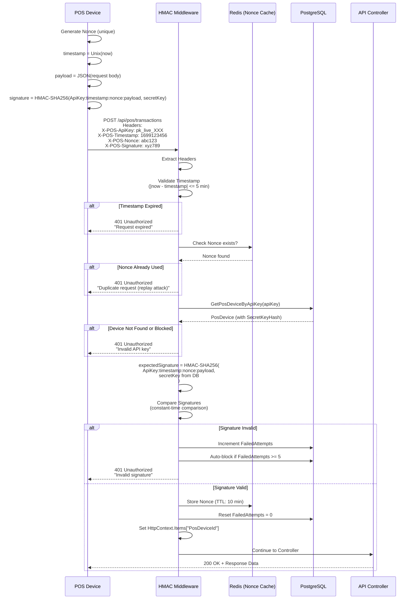

---

## 7. Rewards Redemption Flow

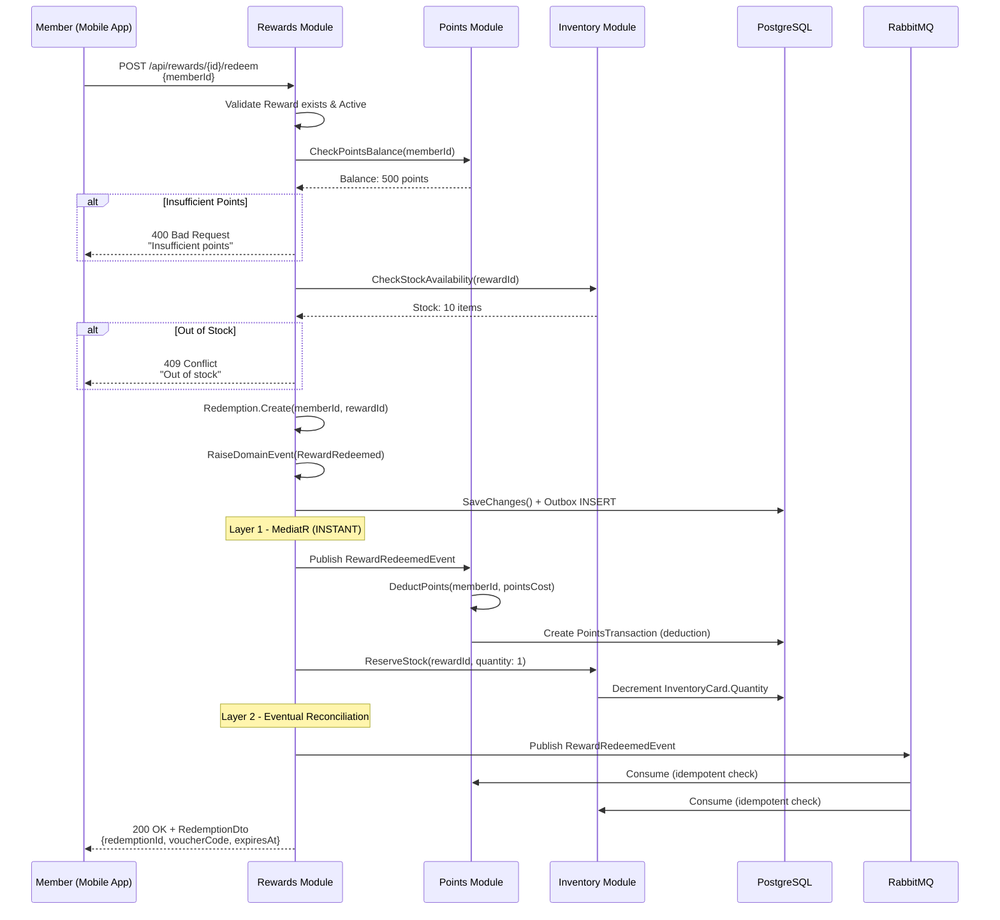

---

## 8. Campaign Achievement Progress Flow

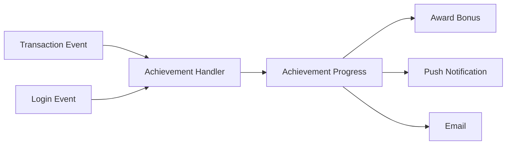

---

## 9. Database Schema - Module Isolation

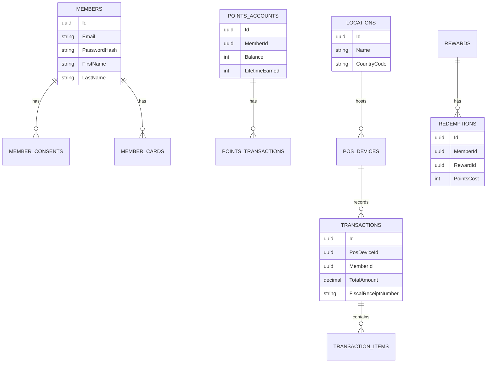

---

## 10. CI/CD Pipeline - Automated Deployment

```mermaid
graph LR
    subgraph "Developer Workflow"
        Dev[Developer<br/>Code Changes]
        PR[Pull Request<br/>GitHub]
    end

    subgraph "CI Pipeline - GitHub Actions"
        Build[Build<br/>.NET 9 SDK]
        Test[Run Tests<br/>1,287 tests]
        Docker[Build Docker Images<br/>API + Backoffice]
        Push[Push to Registry<br/>Docker Hub / ACR]
    end

    subgraph "CD Pipeline - Kubernetes"
        Helm[Helm Chart Apply<br/>Update Deployment]
        RollingUpdate[Rolling Update<br/>Zero Downtime]
        HealthCheck[Health Checks<br/>Liveness/Readiness]
        Migrate[Auto-Migrate DB<br/>EF Core MigrateAsync]
    end

    subgraph "Production Environment"
        K8s[Kubernetes Cluster<br/>3 API Pods]
        Monitor[Monitoring<br/>Application Insights]
        Alerts[Alerts<br/>Slack/Email]
    end

    Dev --> PR
    PR -->|Merge to main| Build
    Build --> Test
    Test -->|Pass| Docker
    Docker --> Push
    Push --> Helm
    Helm --> Migrate
    Migrate --> RollingUpdate
    RollingUpdate --> HealthCheck
    HealthCheck -->|Pass| K8s
    K8s --> Monitor
    Monitor -->|Failures| Alerts

    classDef dev fill:#9cf,stroke:#333,stroke-width:2px
    classDef ci fill:#9f9,stroke:#333,stroke-width:2px
    classDef cd fill:#fc9,stroke:#333,stroke-width:2px
    classDef prod fill:#f96,stroke:#333,stroke-width:2px

    class Dev,PR dev
    class Build,Test,Docker,Push ci
    class Helm,RollingUpdate,HealthCheck,Migrate cd
    class K8s,Monitor,Alerts prod
```

---

## 11. External System Integrations - Current & Planned

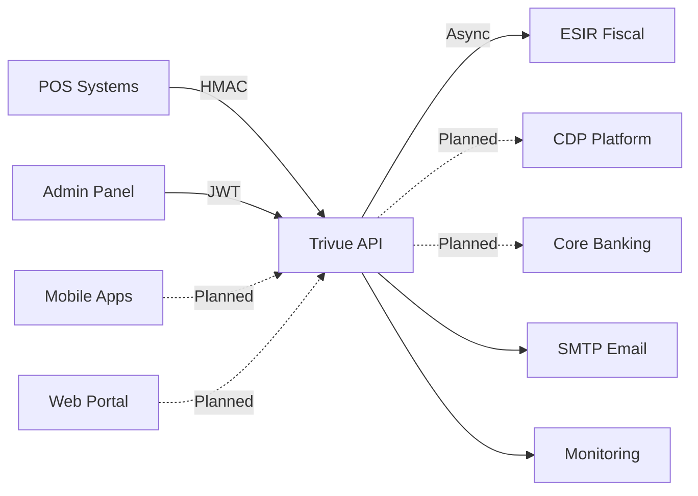

---

## Legenda

**Boje i Simboli:**

- 🟦 **Plavo:** Core moduli (Members, Points, Rewards)
- 🟩 **Zeleno:** Marketing moduli (Campaigns, Referrals, Vouchers)
- 🟥 **Crveno:** Integration moduli (Integration, Locations, Products)
- 🟨 **Žuto:** Support moduli (Analytics, Inventory)
- ⬜ **Sivo:** Infrastructure (PostgreSQL, Redis, RabbitMQ)
- 🟪 **Ljubičasto:** External systems (POS, ESIR, Mobile)

**Event Flow Stilovi:**

- **Puna linija (→):** Synchronous API calls
- **Isprekidana linija (-.->):** Asynchronous events (RabbitMQ)
- **Debela linija:** Critical path
- **Tanka linija:** Support/optional path

---

## Napomene

1. **Triple-Layer Architecture** je centralna inovacija - omogućava INSTANT feedback (Layer 1) + EVENTUAL consistency (Layer 2) + CACHE invalidation (Layer 3)

2. **ICrossModuleEvent Pattern** eliminiše duplo procesiranje - cross-module eventi se preskačaju u Layer 1 i procesiraju SAMO kroz Layer 2 (RabbitMQ)

3. **HMAC Authentication** omogućava sigurnu POS integraciju bez OAuth2 kompleksnosti - replay attack prevention, auto-blocking, per-device keys

4. **Horizontal Scaling** je trivijalno - stateless API sa load balancer-om, PostgreSQL read replicas, Redis cluster

5. **Microservices Migration** je jednostavna - moduli već komuniciraju preko events, ekstraktovanje zahteva samo deployment kao nezavisni container

---

**Kraj dokumenta.**

**Verzija:** 1.0
**Datum:** 2025-11-07
**Autor:** Architecture Team + Claude Code

