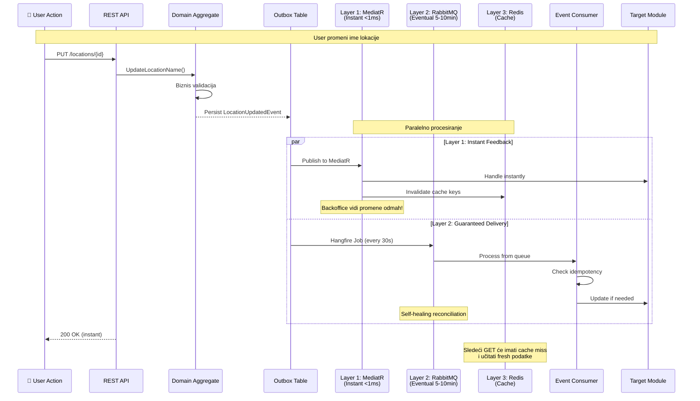
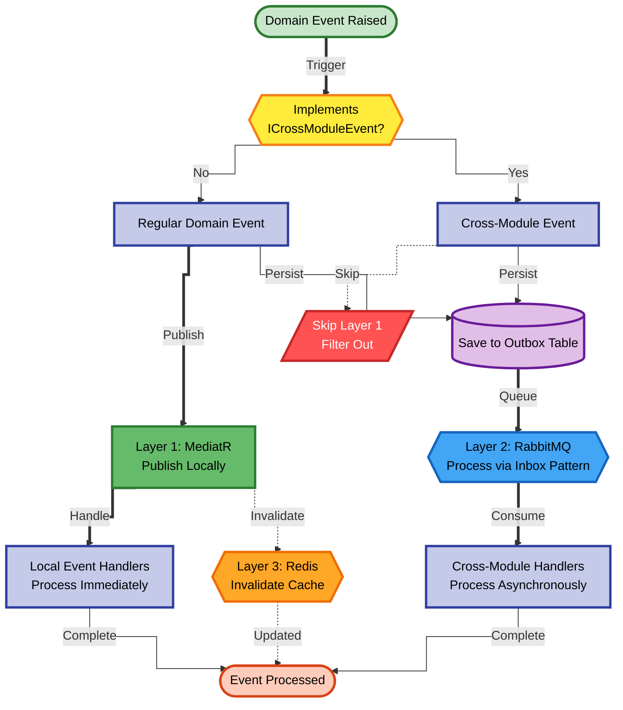
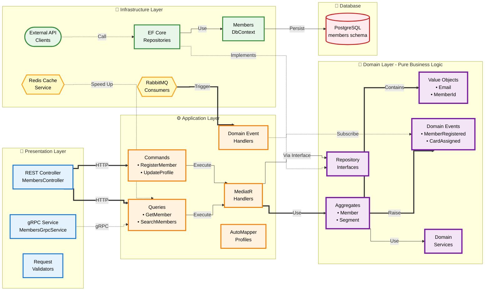
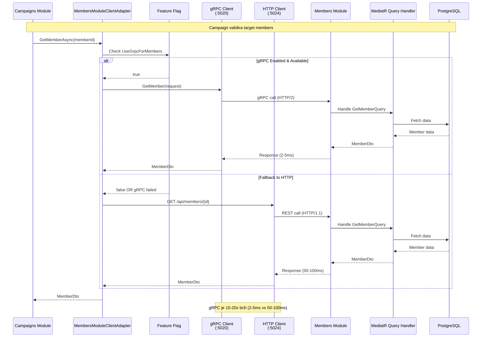
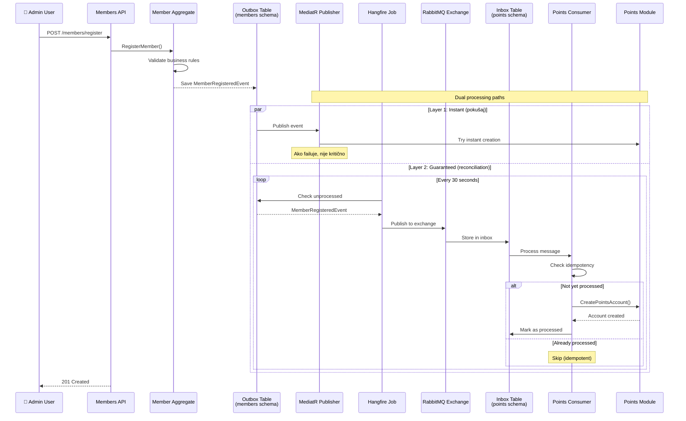
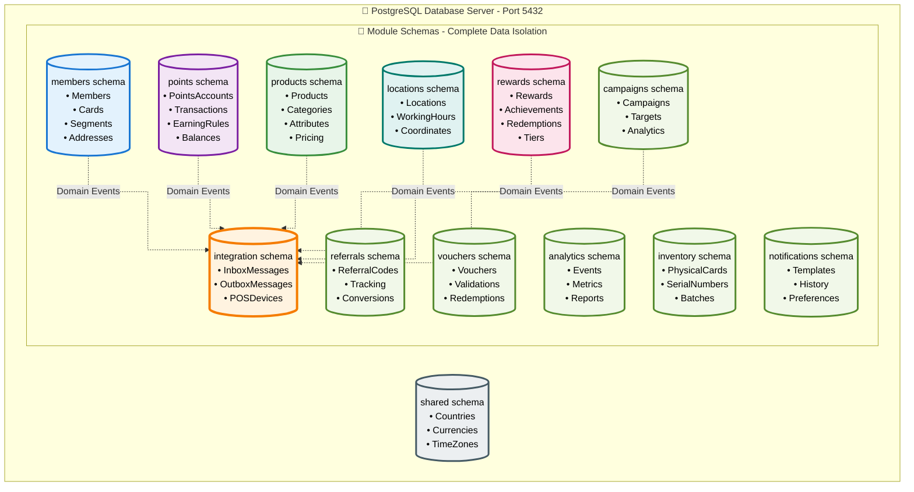
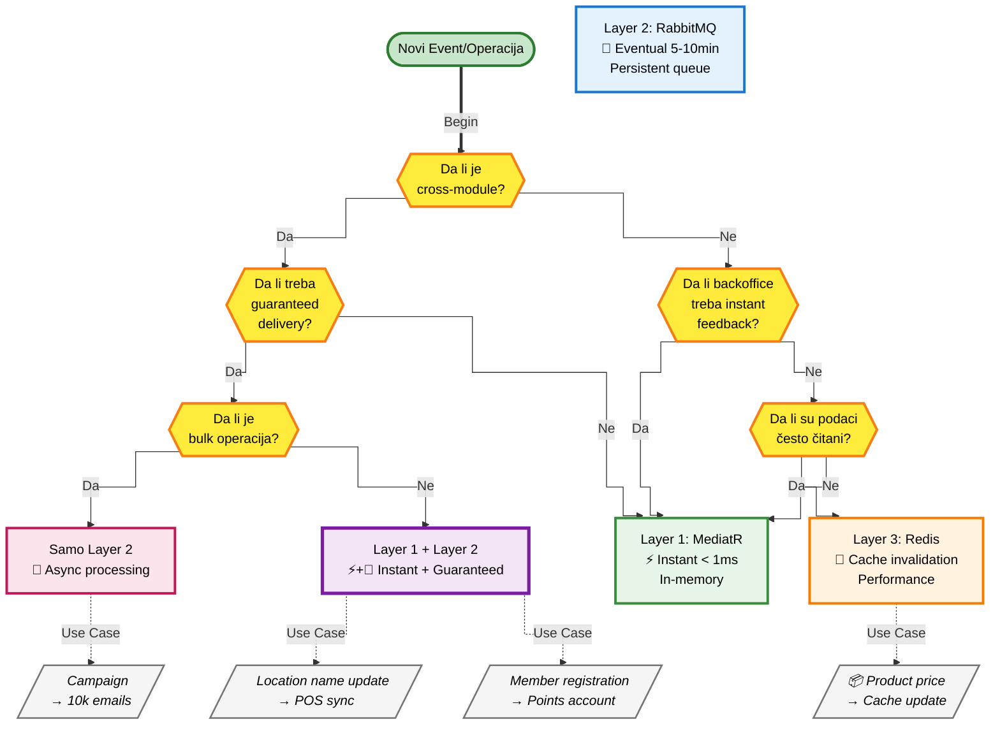

# Trivue Platform - Vizuelni Dijagrami Arhitekture

Ovaj dokument sadrži kompletne vizuelne dijagrame koji prikazuju arhitekturu Trivue platforme. Dijagrami su kreirani korišćenjem Mermaid syntax-e za maksimalnu kompatibilnost sa GitHub, GitLab i drugim markdown renderer-ima. Svaki dijagram vizualno predstavlja ključne arhitekturne koncepte detaljno opisane u glavnoj dokumentaciji.

## 1. High-Level System Architecture

Kompletan pregled Trivue platforme sa svim eksternim integracijama, API gateway-em, 12 biznis modula i infrastrukturnim komponentama. Ovaj dijagram prikazuje kako različiti delovi sistema komuniciraju i koji protokoli se koriste za komunikaciju.

```mermaid
%%{init: {'flowchart': {'curve': 'step'}}}%%
graph TD
    subgraph external ["🌐 External Systems"]
        MobileApp([📱 Mobile App<br/>iOS/Android])
        BackOffice([💻 Backoffice UI<br/>Next.js 16])
        POSTerminals([🏪 POS Terminals<br/>HMAC Auth])
        EmailProviders([📧 Email Providers<br/>SendGrid/SMTP])
        SMSGateway([📤 SMS Gateway<br/>Twilio/InfoBip])
    end

    subgraph gateway ["🚀 API Gateway Layer"]
        NGINX[🔒 NGINX Reverse Proxy<br/>Load Balancing<br/>SSL Termination<br/>Rate Limiting]

        subgraph apis ["API Endpoints"]
            APIGateway[🔌 REST API Gateway<br/>Port :5024<br/>HTTP/1.1<br/>Public Facing]
            GRPCEndpoint[⚡ gRPC Internal API<br/>Port :5020<br/>HTTP/2<br/>Internal Only]
        end
    end

    subgraph modules ["💎 Business Modules - Modular Monolith"]
        subgraph core ["🏛️ Core Modules"]
            Members[👥 Members Module<br/>DDD Reference<br/>• User Management<br/>• Segmentation]
            Points[💰 Points Module<br/>• Earning Rules<br/>• Transactions<br/>• Balance Tracking]
            Products[📦 Products Module<br/>• Catalog Management<br/>• Categories<br/>• Pricing Rules]
        end

        subgraph features ["🎯 Feature Modules"]
            Rewards[🏆 Rewards Module<br/>• Achievements<br/>• Tiers<br/>• Benefits]
            Campaigns[📢 Campaigns Module<br/>• Promotions<br/>• Targeting<br/>• Analytics]
            Vouchers[🎟️ Vouchers Module<br/>• Generation<br/>• Validation<br/>• Redemption]
            Referrals[🔄 Referrals Module<br/>• Tracking<br/>• Conversions<br/>• Commissions]
        end

        subgraph support ["🛠️ Support Modules"]
            Locations[📍 Locations Module<br/>• Store Management<br/>• Working Hours<br/>• Geo Data]
            Analytics[📊 Analytics Module<br/>• Reports<br/>• Metrics<br/>• KPIs]
            Integration[🔗 Integration Module<br/>Inbox Pattern<br/>• POS Sync<br/>• Outbox Processing]
            Inventory[📋 Inventory Module<br/>• Card Stock<br/>• Serial Numbers<br/>• Batches]
            Notifications[🔔 Notifications Module<br/>• Templates<br/>• Scheduling<br/>• Multi-channel]
        end
    end

    subgraph infra ["🔧 Infrastructure Layer"]
        subgraph dataLayer ["💾 Data Persistence"]
            PostgreSQL[(🐘 PostgreSQL 17<br/>12 Module Schemas<br/>• members<br/>• points<br/>• products<br/>• rewards<br/>• campaigns<br/>• locations<br/>• vouchers<br/>• referrals<br/>• analytics<br/>• integration<br/>• inventory<br/>• notifications)]
        end

        subgraph messagingLayer ["📬 Messaging & Caching"]
            Redis{{💨 Redis Cache<br/>Distributed<br/>• Query Results<br/>• Session Data<br/>• Feature Flags}}
            RabbitMQ{{🐰 RabbitMQ<br/>Message Broker<br/>• Domain Events<br/>• Async Processing<br/>• Dead Letter Queue}}
        end

        subgraph jobsLayer ["⏰ Background Processing"]
            Hangfire[/📅 Hangfire<br/>Background Jobs<br/>• Outbox Processing<br/>• Scheduled Tasks<br/>• Recurring Jobs/]
        end
    end

    subgraph monitoring ["📊 Monitoring & Observability"]
        AppInsights[☁️ Azure App Insights<br/>• APM<br/>• Error Tracking<br/>• User Analytics]
        Seq[📝 Seq Logging<br/>• Structured Logs<br/>• Log Aggregation<br/>• Search & Filter]
        Grafana[📈 Grafana Dashboards<br/>• Real-time Metrics<br/>• Alerts<br/>• Visualization]
    end

    %% External to Gateway connections
    MobileApp ==>|REST/JWT| NGINX
    BackOffice ==>|REST/JWT| NGINX
    POSTerminals ==>|HMAC Auth| NGINX

    %% Gateway to APIs
    NGINX ==>|Proxy| APIGateway
    NGINX -.->|Internal| GRPCEndpoint

    %% APIs to Core Modules
    APIGateway -->|MediatR| Members
    APIGateway -->|MediatR| Points
    APIGateway -->|MediatR| Products

    %% APIs to Feature Modules
    APIGateway -->|CQRS| Rewards
    APIGateway -->|CQRS| Campaigns
    APIGateway -->|CQRS| Vouchers
    APIGateway -->|CQRS| Referrals

    %% APIs to Support Modules
    APIGateway -->|Commands| Locations
    APIGateway -->|Queries| Analytics
    APIGateway -->|Process| Integration
    APIGateway -->|Manage| Inventory
    APIGateway -->|Send| Notifications

    %% gRPC connections (internal only)
    GRPCEndpoint -.->|Read Only| Members
    GRPCEndpoint -.->|Read Only| Points
    GRPCEndpoint -.->|Read Only| Products

    %% Module to Database connections
    Members ==>|EF Core| PostgreSQL
    Points ==>|EF Core| PostgreSQL
    Products ==>|EF Core| PostgreSQL
    Rewards ==>|EF Core| PostgreSQL
    Campaigns ==>|EF Core| PostgreSQL
    Locations ==>|EF Core| PostgreSQL
    Integration ==>|EF Core| PostgreSQL

    %% Cache connections
    Members -.->|Cache| Redis
    Points -.->|Cache| Redis
    Products -.->|Cache| Redis
    Analytics -.->|Cache| Redis
    Campaigns -.->|Cache| Redis

    %% Event Bus connections
    Integration ==>|Publish| RabbitMQ
    Members ==>|Publish| RabbitMQ
    Points ==>|Publish| RabbitMQ
    Locations ==>|Publish| RabbitMQ
    Campaigns ==>|Subscribe| RabbitMQ
    Notifications ==>|Subscribe| RabbitMQ

    %% Background Jobs
    Hangfire -.->|Process| RabbitMQ
    Hangfire -.->|Schedule| Notifications
    Hangfire -.->|Outbox| Integration

    %% External integrations
    Notifications ==>|Send| EmailProviders
    Notifications ==>|Send| SMSGateway

    %% Monitoring connections
    Members -.->|Telemetry| AppInsights
    Points -.->|Telemetry| AppInsights
    Integration -.->|Logs| Seq
    Analytics -.->|Metrics| Grafana
    Campaigns -.->|Performance| Grafana

    %% Style definitions
    classDef external fill:#e3f2fd,stroke:#1976d2,stroke-width:3px,color:#000,padding:10px
    classDef api fill:#fff3e0,stroke:#f57c00,stroke-width:3px,color:#000,padding:10px
    classDef module fill:#f3e5f5,stroke:#7b1fa2,stroke-width:3px,color:#000,padding:10px
    classDef database fill:#ffebee,stroke:#c62828,stroke-width:3px,color:#000,padding:10px
    classDef messaging fill:#fff9c4,stroke:#f9a825,stroke-width:3px,color:#000,padding:10px
    classDef cache fill:#e0f2f1,stroke:#00796b,stroke-width:3px,color:#000,padding:10px
    classDef jobs fill:#fce4ec,stroke:#ad1457,stroke-width:3px,color:#000,padding:10px
    classDef monitor fill:#f1f8e9,stroke:#558b2f,stroke-width:3px,color:#000,padding:10px

    %% Apply styles
    class MobileApp,BackOffice,POSTerminals,EmailProviders,SMSGateway external
    class NGINX,APIGateway,GRPCEndpoint api
    class Members,Points,Products,Rewards,Referrals,Locations,Vouchers,Campaigns,Analytics,Integration,Inventory,Notifications module
    class PostgreSQL database
    class RabbitMQ messaging
    class Redis cache
    class Hangfire jobs
    class AppInsights,Seq,Grafana monitor
```

## 2. Triple-Layer Event-Driven Architecture

Prikaz revolucionarnog triple-layer sistema koji kombinuje brzinu instant feedback-a sa pouzdanošću eventual consistency i performansama cache sistema. Svaki sloj ima specifičnu ulogu u garantovanju brzih response vremena i pouzdane komunikacije između modula.

## 3. ICrossModuleEvent Pattern Flow

Elegantno rešenje koje eliminiše duplo procesiranje cross-module event-a. Eventi označeni sa ICrossModuleEvent interfejsom automatski se preskaču u Layer 1 i procesiraju isključivo kroz Layer 2, što garantuje da se svaki event procesira tačno jednom.

## 4. Hexagonal Architecture - Single Module Deep Dive

Detaljan prikaz hexagonal arhitekture na primeru Members modula. Prikazuje četiri sloja sa jasnom separacijom koncerna i dependency inversion principom. Domain sloj nikad ne zavisi od Infrastructure sloja - to je nepovredivo pravilo.

## 5. gRPC Internal API Architecture (4th Layer)

Opcioni četvrti sloj koji omogućava brze sinhrone read operacije između modula. gRPC server reuse-uje iste MediatR query handler-e kao REST API, dok client implementacija uključuje automatski fallback na HTTP ako gRPC nije dostupan.

## 6. Module Communication via Events

Konkretan primer kako Members modul komunicira sa Points modulom preko event-driven arhitekture. Prikazuje kompletni flow od registracije member-a do kreiranja points account-a sa Outbox i Inbox pattern-ima.

## 7. Database Schema-per-Module Architecture

Prikaz kako svaki od 12 modula ima sopstvenu PostgreSQL schema-u, što omogućava laku transformaciju u mikroservise. Svaki modul potpuno poseduje svoje podatke i ne deli tabele sa drugim modulima.

## 8. Microservices Migration Path

Vizuelni prikaz kako će platforma evoluirati od trenutnog modular monolith-a ka potpunoj mikroservisnoj arhitekturi. Plan migracije omogućava postupnu transformaciju bez prekida u radu sistema.

```mermaid
%%{init: {'flowchart': {'curve': 'step'}}}%%
graph TD
    subgraph current ["📦 Trenutno Stanje - Modular Monolith (2025)"]
        subgraph single ["Single Deployment Unit"]
            MM_API[REST API :5024<br/>+ gRPC :5020]
            MM_Modules[12 Modules<br/>Members, Points, Products...]
            MM_DB[(Single PostgreSQL<br/>12 Schemas)]
            MM_Infra{{RabbitMQ + Redis<br/>+ Hangfire}}
        end

        MM_API ==>|Direct| MM_Modules
        MM_Modules -->|EF Core| MM_DB
        MM_Modules -.->|Events| MM_Infra
    end

    Arrow1[["⬇️ Faza 1-2: Infrastructure Setup ⬇️"]]

    subgraph transition ["🔄 Prelazno Stanje (2026 Q1-Q2)"]
        subgraph gateway ["API Gateway Added"]
            T_Gateway[Kong/Ocelot<br/>Gateway]
            T_Discovery{{Consul Service<br/>Discovery}}
            T_Monolith[Monolith sa<br/>10 modula]
            T_Integration[Integration Service<br/>Prvi mikroservis]
            T_Analytics[Analytics Service<br/>Drugi mikroservis]
        end

        T_Gateway ==>|Route| T_Discovery
        T_Discovery -->|Register| T_Monolith
        T_Discovery -->|Register| T_Integration
        T_Discovery -->|Register| T_Analytics
    end

    Arrow2[["⬇️ Faza 3-5: Full Decomposition ⬇️"]]

    subgraph future ["🚀 Buduće Stanje - Microservices (2026 Q3-Q4)"]
        subgraph mesh ["Service Mesh Architecture"]
            F_Gateway[API Gateway<br/>+ Load Balancer]
            F_Discovery{{Service Discovery<br/>+ Health Checks}}

            subgraph core ["Core Services"]
                F_Members[Members Service<br/>Own DB]
                F_Points[Points Service<br/>Own DB]
                F_Products[Products Service<br/>Own DB]
                F_Rewards[Rewards Service<br/>Own DB]
            end

            subgraph supporting ["Supporting Services"]
                F_Integration[Integration Service<br/>Own DB]
                F_Analytics[Analytics Service<br/>Own DB]
                F_Notifications[Notifications Service<br/>Own DB]
            end

            subgraph infra2 ["Infrastructure"]
                F_Kafka{{Kafka<br/>Event Stream}}
                F_Redis{{Redis Cache<br/>Cluster}}
                F_Monitoring[/Distributed Tracing<br/>+ Monitoring/]
            end
        end

        F_Gateway ==>|Route| F_Discovery
        F_Discovery -.->|Discover| F_Members
        F_Discovery -.->|Discover| F_Points
        F_Discovery -.->|Discover| F_Integration

        F_Members ==>|Publish| F_Kafka
        F_Points ==>|Publish| F_Kafka
        F_Integration ==>|Subscribe| F_Kafka

        F_Members -.->|Cache| F_Redis
        F_Analytics -.->|Cache| F_Redis
    end

    classDef currentState fill:#ffeb3b,stroke:#f57c00,stroke-width:3px,color:#000
    classDef transitionState fill:#66bb6a,stroke:#2e7d32,stroke-width:3px,color:#000
    classDef futureState fill:#42a5f5,stroke:#1565c0,stroke-width:3px,color:#000
    classDef gateway fill:#ff7043,stroke:#d84315,stroke-width:4px,color:#000
    classDef service fill:#f3e5f5,stroke:#7b1fa2,stroke-width:3px,color:#000
    classDef infra fill:#e0f2f1,stroke:#00796b,stroke-width:3px,color:#000
    classDef messaging fill:#fff9c4,stroke:#f9a825,stroke-width:3px,color:#000
    classDef arrow fill:#e8eaf6,stroke:#3f51b5,stroke-width:2px,color:#000

    class MM_API,MM_Modules currentState
    class T_Integration,T_Analytics transitionState
    class F_Members,F_Points,F_Products,F_Rewards,F_Integration,F_Analytics,F_Notifications service
    class T_Gateway,F_Gateway gateway
    class MM_DB,MM_Infra,T_Discovery,F_Discovery,F_Redis infra
    class F_Kafka messaging
    class Arrow1,Arrow2 arrow
```

## 9. Event Flow Decision Matrix

Vizuelni vodič koji pomaže developerima da odluče koji layer da koriste za različite scenarije. Prikazuje decision tree sa jasnim kriterijumima za izbor između Layer 1, Layer 2 i Layer 3.

## Dodatne Napomene

Svi dijagrami koriste Mermaid syntax koji je potpuno kompatibilan sa:
- GitHub markdown rendering
- GitLab markdown rendering
- VS Code sa Mermaid preview ekstenzijom
- Većinom modernih dokumentacionih alata

Za najbolji prikaz preporučujemo korišćenje GitHub-a ili alata sa Mermaid podrškom. Dijagrami su dizajnirani da budu čitljivi i u običnom markdown formatu kao kod blokovi.

---

*Dokumentovano: 2025-11-14*
*Verzija: 1.2*
*Status: Production Ready - Fixed Mermaid Rendering Issues*